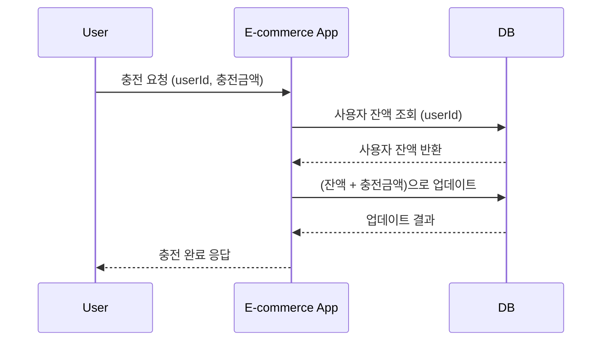
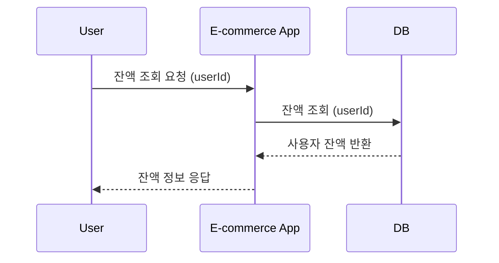
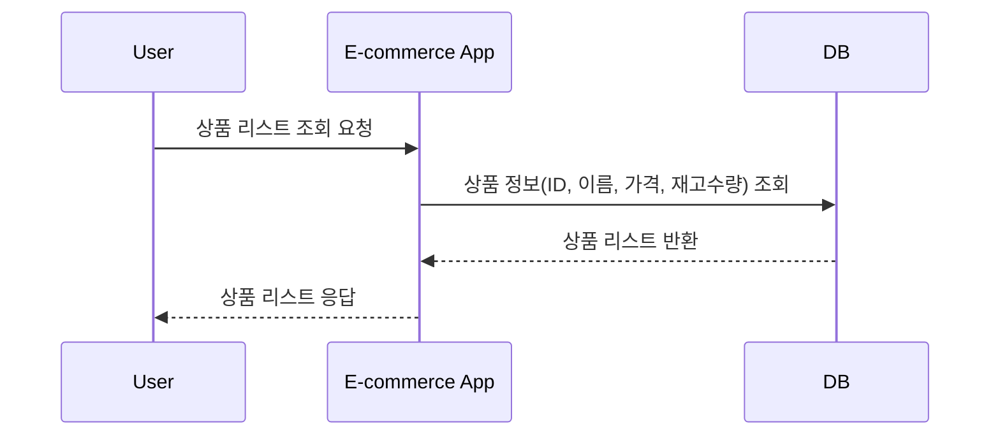
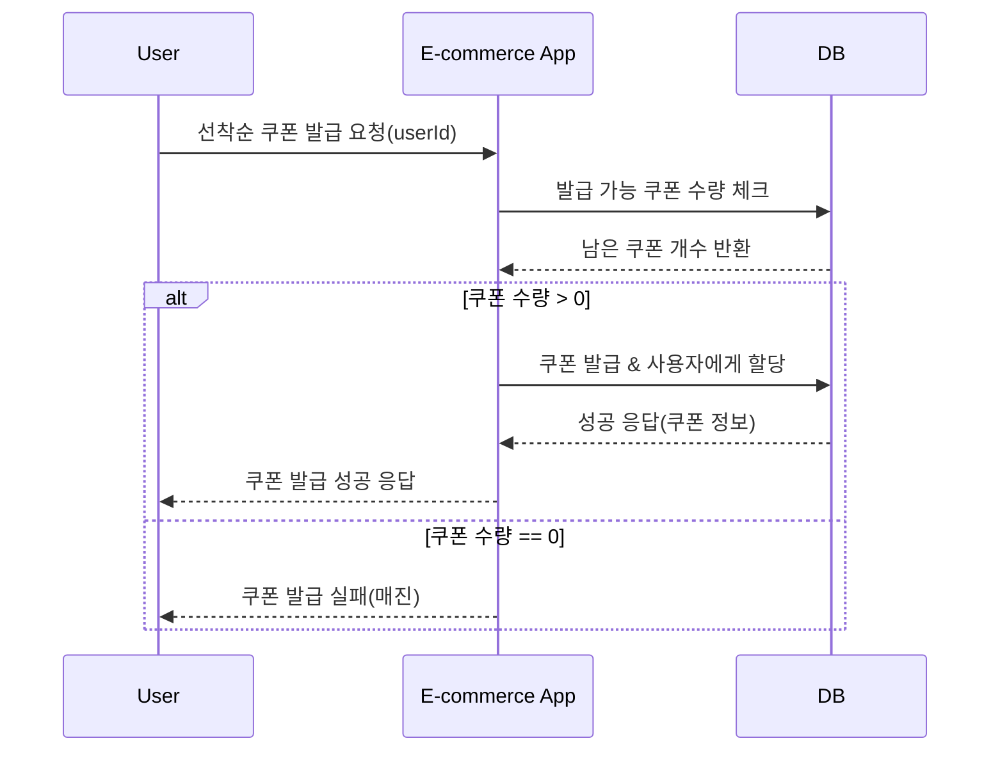
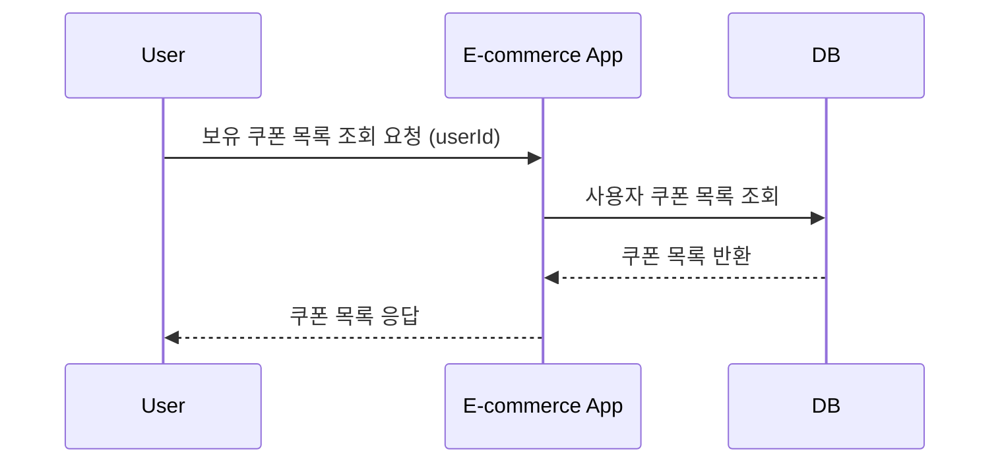
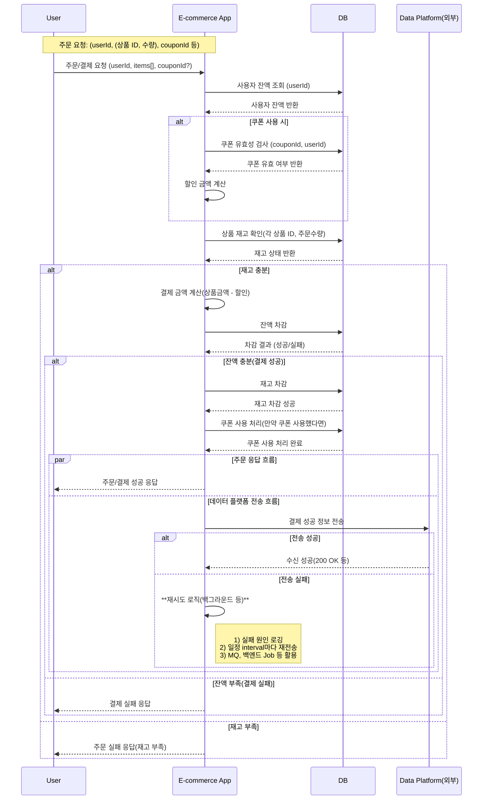
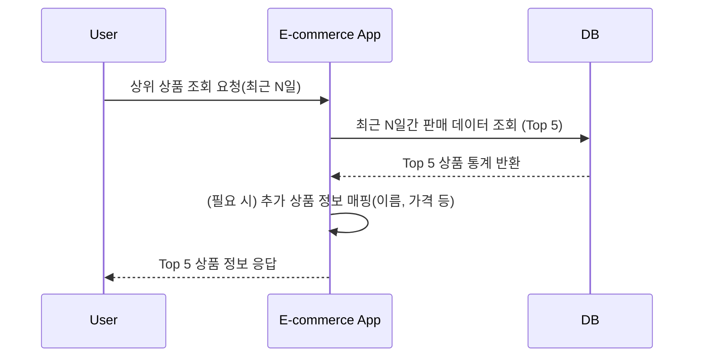
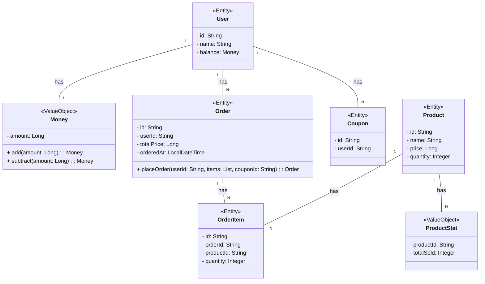

# 항해99 백엔드 플러스 3주차 과제 (CH 2-1. 서버 구축)

## Getting Started

### Prerequisites

#### Running Docker Containers

`local` profile 로 실행하기 위하여 인프라가 설정되어 있는 Docker 컨테이너를 실행해주셔야 합니다.

```bash
docker-compose up -d
```

# e-커머스 서비스

## 시나리오 요구사항 분석

### 잔액 충전 API



### Request
```http request
POST /api/v1/users/{userId}/balance
Content-Type: application/json

{
    "amount": 10000
}
```

### Response
```http request
204 No Content
Content-Type: application/json
Location: /api/v1/users/{userId}/balance
```

### Error Response

#### 요청 값이 잘못된 경우 (400 Bad Request)

- 음수 값으로 충전 요청
- 한번에 충전할 수 있는 최대 금액 초과

```http request
400 Bad Request
Content-Type: application/json

{
    "errorCode": "INVALID_AMOUNT_REQUEST",
    "message": "충전 요청 금액이 올바르지 않습니다."
}
```

#### 사용자가 존재하지 않는 경우 (404 Not Found)

- 존재하지 않는 사용자 ID로 요청

```http request
404 Not Found
Content-Type: application/json

{
    "errorCode": "USER_NOT_FOUND",
    "message": "사용자를 찾을 수 없습니다."
}
```

### 잔액 조회



### Request
```http request
GET /api/v1/users/{userId}/balance
Content-Type: application/json
```

### Response
```http request
200 OK
Content-Type: application/json

{
    "balance": 10000
}
```

### Error Response
```http request
404 Not Found
Content-Type: application/json

{
    "errorCode": "USER_NOT_FOUND",
    "message": "사용자를 찾을 수 없습니다."
}
```

### 상품 조회



### Request
```http request
GET /api/v1/products?page=0&size=10&sort=price,desc
Content-Type: application/json
```

#### Query Parameters

| 파라미터명  | 타입     | 설명                            | 필수 여부 | 기본값            |
|--------|--------|-------------------------------|-------|----------------|
| `page` | int    | 페이지 번호 (ex. `page=0`)         | N     | 0              |
| `size` | int    | 페이지 당 아이템 수  (ex. `size=20`)  | N     | 10             |
| `sort` | string | 정렬 기준 (ex. `sort=price,desc`) | N     | createdAt,desc |

### Response
```http request
200 OK
Content-Type: application/json

{
    "page": 1,
    "size": 10,
    "totalElements": 57,
    "totalPages": 6,
    "sort": "price,desc",
    "content": [
        {
            "productId": "P003",
            "productName": "Premium Item",
            "price": 30000,
            "quantity": 20,
            "createdAt": "2021-08-01T00:00:00",
        },
        {
            "productId": "P002",
            "productName": "Great Item",
            "price": 20000,
            "quantity": 3,
            "createdAt": "2021-08-01T00:00:00",
        },
        ...
    ]
}
```

### 선착순 할인 쿠폰 발급



### Request
```http request
POST /api/v1/coupons/{couponId}
Content-Type: application/json

{
    "userId": "user1"
}
```

### Request Parameters

| 파라미터명    | 타입  | 설명              | 필수 여부 | 기본값 |
|----------|-----|-----------------|-------|-----|
| `userId` | int | 쿠폰을 발급받을 사용자 ID | Y     |     |

### Response
```http request
201 Created
Content-Type: application/json
Location: /api/v1/users/{userId}/coupons
```

### Error Responses

#### 쿠폰 발급 실패 (409 Conflict)

- 남은 쿠폰 수량이 0인 경우

```http request
409 Conflict
Content-Type: application/json

{
    "errorCode": "COUPON_SOLD_OUT",
    "message": "쿠폰이 모두 소진되었습니다."
}
```

#### 존재하지 않는 쿠폰을 요청 (404 Not Found)

- 존재하지 않는 쿠폰 ID로 요청

```http request
404 Not Found
Content-Type: application/json

{
    "errorCode": "COUPON_NOT_FOUND",
    "message": "존재하지 않는 쿠폰입니다."
}
```

### 유저가 보유한 쿠폰 조회



### Request
```http request 
GET /api/v1/users/{userId}/coupons
Content-Type: application/json
```

### Response
```http request
200 OK
Content-Type: application/json

[
    {
        "couponId": "C001",
        "createdAt": "2021-08-01T00:00:00",
    },
    {
        "couponId": "C002",
        "createdAt": "2021-08-01T00:00:00",
    },
    ...
]
```

### 상품 주문



### Request
```http request
POST /api/v1/orders
Content-Type: application/json

{
    "userId": "user1",
    "couponId": "C001",
    "products": [
        {
            "productId": "P001",
            "quantity": 2
        },
        {
            "productId": "P002",
            "quantity": 1
        }
    ]
}
```

### Response
```http request
201 Created
Content-Type: application/json
Location: /api/v1/orders/{orderId}

{
    "orderId": "O001",
    "totalPrice": 50000,
    "orderedAt": "2021-08-01T00:00:00",
}
```

### Error Responses

#### 잔액 부족 (402 Payment Required)

- 주문 금액이 잔액보다 큰 경우

```http request
402 Payment Required
Content-Type: application/json

{
    "errorCode": "INSUFFICIENT_BALANCE",
    "message": "잔액이 부족합니다."
}
```

#### 재고 부족 (409 Conflict)

- 주문 수량이 재고 수량보다 많은 경우

```http request
409 Conflict
Content-Type: application/json

{
    "errorCode": "INSUFFICIENT_STOCK",
    "message": "재고가 부족합니다."
}
```

#### 쿠폰 유효하지 않음 (400 Bad Request)

- 유효하지 않은 쿠폰으로 요청한 경우 (쿠폰이 존재하지 않거나, 사용자에게 할당되지 않은 경우)

```http request
400 Bad Request
Content-Type: application/json

{
    "errorCode": "INVALID_COUPON",
    "message": "유효하지 않은 쿠폰입니다."
}
```

#### 상위 상품 조회



### Request
```http request
GET /api/v1/products/top-sold?startDate=2021-08-01T00:00:00Z&endDate=2021-08-07T00:00:00Z&page=0&size=5
Content-Type: application/json
```

### Request Parameters

| 파라미터명             | 타입   | 설명                          | 필수 여부 | 기본값 |
|-------------------|------|-----------------------------|-------|-----|
| `startDate`       | date | 조회 시작 날짜 (UTC)              | Y     |     |
| `endDate`         | date | 조회 종료 날짜 (UTC)              | Y     |     |
| `page`            | int  | 페이지 번호 (ex. `page=2`)       | N     | 0   |
| `size`            | int  | 페이지 당 아이템 수 (ex. `size=20`) | N     | 5   |

### Response
```http request
200 OK
Content-Type: application/json

[
    {
        "productId": "P001",
        "productName": "Best Item",
        "price": 10000,
        "quantity": 100,
        "totalSold": 50,
    },
    {
        "productId": "P002",
        "productName": "Great Item",
        "price": 20000,
        "quantity": 30,
        "totalSold": 30,
    },
    ...
]
```

### Error Response

#### 조회 기간이 너무 큰 경우 (400 Bad Request)

- 조회 기간이 180일을 초과하는 경우

```http request
400 Bad Request
Content-Type: application/json

{
    "errorCode": "INVALID_PERIOD",
    "message": "조회 기간은 최대 180일까지 가능합니다."
}
```

#### 조회 상품 수가 너무 큰 경우 (400 Bad Request)

- 조회 상품 수가 100개를 초과하는 경우

```http request
400 Bad Request
Content-Type: application/json

{
    "errorCode": "INVALID_LIMIT",
    "message": "조회 상품 수는 최대 100개까지 가능합니다."
}
```

## ERD

### 도메인 모델

