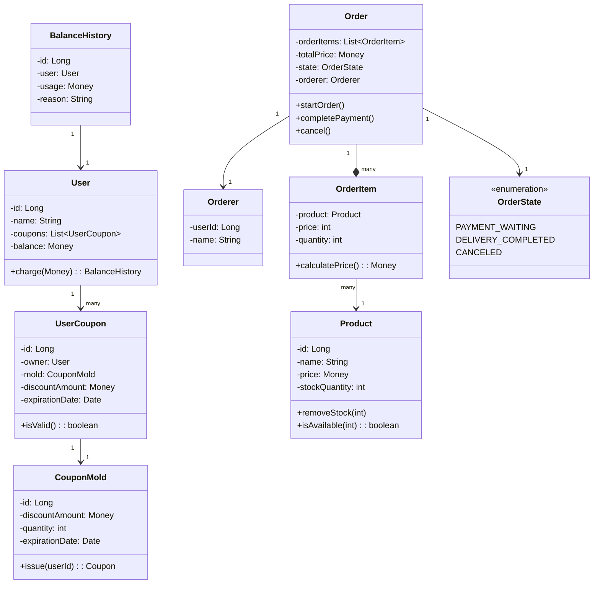

```mermaid
classDiagram
    
    class User {
        -id: Long
        -name: String
        -coupons: List~UserCoupon~
        -balance: Money
        +charge(Money): BalanceHistory
    }
    
    User "1" --> "many" UserCoupon
    
    class BalanceHistory {
        -id: Long
        -user: User
        -usage: Money
        -reason: String
    }
    
    class CouponMold {
        -id: Long
        -discountAmount: Money
        -quantity: int
        -expirationDate: Date
        +issue(userId): Coupon
    }

    class UserCoupon {
        -id: Long
        -owner: User
        -mold: CouponMold
        -discountAmount: Money
        -expirationDate: Date
        +isValid(): boolean
    }

    UserCoupon "1" --> "1" CouponMold
    
    BalanceHistory "1" --> "1" User
    
    class Order {
        -orderItems: List~OrderItem~
        -totalPrice: Money
        -state: OrderState
        -orderer: Orderer
        +startOrder()
        +completePayment()
        +cancel()
    }
    
    class Orderer {         
        -userId: Long
        -name: String
    }

    class OrderItem {
        -product: Product
        -price: int
        -quantity: int
        +calculatePrice(): Money
    }

    class OrderState {
        <<enumeration>>
        PAYMENT_WAITING
        DELIVERY_COMPLETED
        CANCELED
    }
    
    class Product {
        -id: Long
        -name: String
        -price: Money
        -stockQuantity: int
        +removeStock(int)
        +isAvailable(int): boolean
    }
    
    OrderItem "many" --> "1" Product

    Order "1" --> "1" Orderer
    Order "1" --* "many" OrderItem
    Order "1" --> "1" OrderState
```
