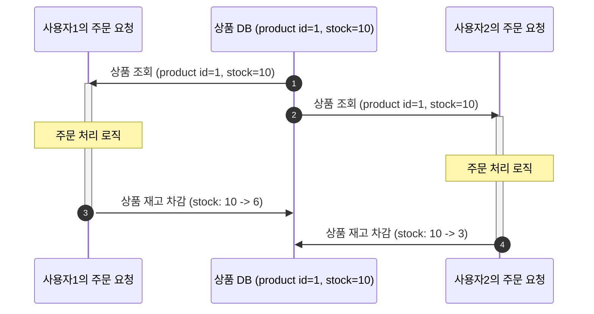
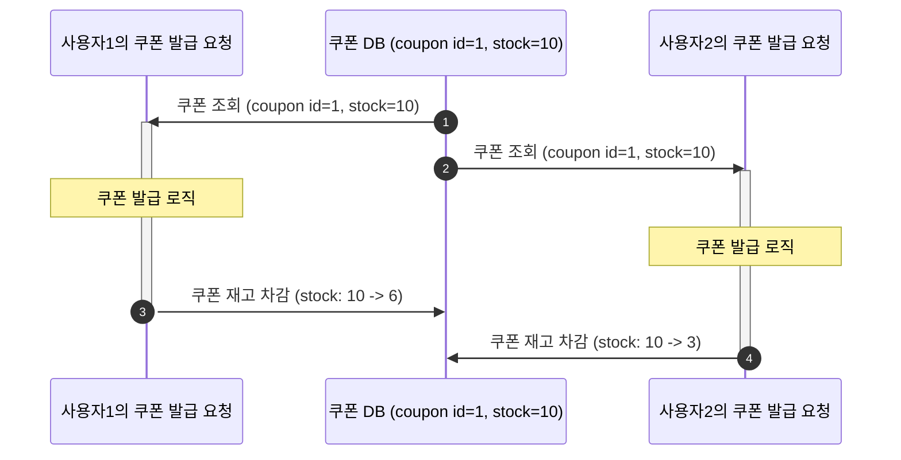
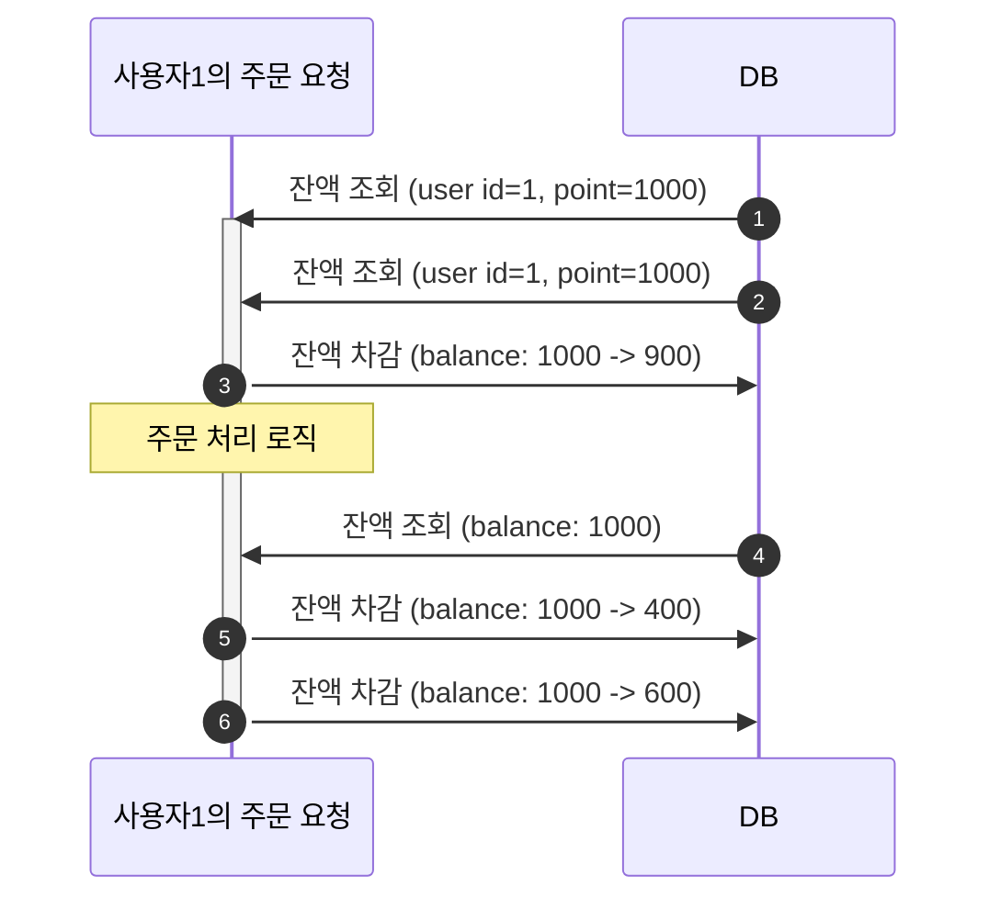

# E-Commerce 프로젝트 동시성 문제 보고서

# 목차

- [동시성 문제란?](#데이터베이스-동시성-문제란)
- [의도하지 않는 결과](#의도하지-않는-결과)
- [데이터베이스 격리 수준](#데이터베이스-격리-수준)
- [E-Commerce 프로젝트에서 발생할 수 있는 동시성 문제](#e-commerce-프로젝트에서-발생할-수-있는-동시성-문제)
  - [CASE 1. 여러 유저가 동시에 같은 상품을 주문하는 경우](#case-1-여러-유저가-동시에-같은-상품을-주문하는-경우)
  - [CASE 2. 여러 유저가 동시에 같은 쿠폰을 발급받는 경우](#case-2-여러-유저가-동시에-같은-쿠폰을-발급받는-경우)
  - [CASE 3. 한 유저가 동시에 같은 상품을 여러 번 주문하는 경우](#case-3-한-유저가-동시에-같은-상품을-여러-번-주문하는-경우)

# (데이터베이스) 동시성 문제란?

데이터베이스의 동일한 데이터에 동시에 여러 작업이 수행될 때, 의도하지 않는 결과가 발생하는 현상을 말한다.

# 의도하지 않는 결과

의도하지 않는 결과라 함은

- Lost Update : 여러 작업이 동시에 수행되면서, 하나의 작업이 다른 작업의 결과를 덮어씌워 작업 결과가 분실되는 현상
- Uncommitted Dependency : 하나의 작업이 다른 작업의 결과를 참조하는데, 다른 작업이 오류가 발생해 롤백시키면서 반영되지 않았어야 할 데이터를 읽는 문제
- Inconsistent Analysis : 하나의 작업이 실행 도중에 동시에 다른 작업이 개입하여 데이터를 변경하면서, 데이터의 일관성이 깨지는 문제

# 데이터베이스 격리 수준

데이터베이스에서 동시성 문제를 해결하기 위해 격리 수준을 제공한다.

- Read Uncommitted (Lv.1) : 한 트랜잭션이 아직 커밋하지 않은 데이터들 다른 트랜잭션이 읽을 수 있는 수준
- Read Committed (Lv.2) : 한 트랜잭션이 커밋한 데이터만 다른 트랜잭션이 읽을 수 있는 수준
- Repeatable Read (Lv.3) : 한 트랜잭션 동안 동일한 조건으로 데이터를 조회하면, 항상 같은 결과를 보장하는 수준
- Serializable (Lv.4) : 모든 트랜잭션이 순차적으로 실행되는 것과 동일한 결과를 보장하는 수준

| 격리 수준            | Dirty Read | Non-repeatable read | Phantom read |
|------------------|------------|---------------------|--------------|
| Read Uncommitted | O          | O                   | O            |
| Read Committed   | X          | O                   | O            |
| Repeatable Read  | X          | X                   | O            |
| Serializable     | X          | X                   | X            |

# E-Commerce 프로젝트에서 발생할 수 있는 동시성 문제

- MySQL 8.0 기존 격리 수준 `Repeatable Read`를 기준으로 합니다.

## CASE 1. 여러 유저가 동시에 같은 상품을 주문하는 경우

- Lost Update 유형으로 발생 

## CASE 2. 여러 유저가 동시에 같은 쿠폰을 발급받는 경우

## CASE 3. 한 유저가 동시에 같은 상품을 여러 번 주문하는 경우

