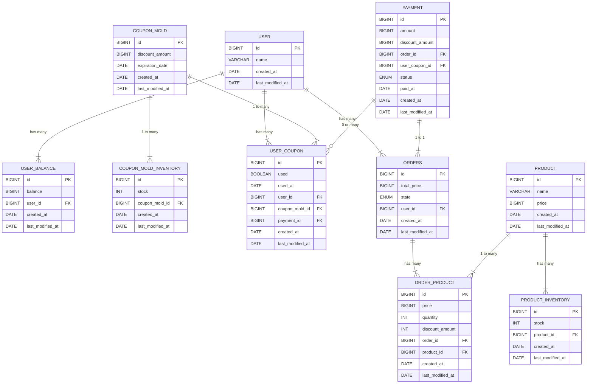

```mermaid
erDiagram
    USER {
        BIGINT id PK
        VARCHAR name
        DATE created_at
        DATE last_modified_at
    }

    USER_BALANCE {
        BIGINT id PK
        BIGINT balance
        BIGINT user_id FK
        DATE created_at
        DATE last_modified_at
    }

    COUPON_MOLD {
        BIGINT id PK
        BIGINT discount_amount
        DATE expiration_date
        DATE created_at
        DATE last_modified_at
    }

    COUPON_MOLD_INVENTORY {
        BIGINT id PK
        INT stock
        BIGINT coupon_mold_id FK
        DATE created_at
        DATE last_modified_at
    }

    USER_COUPON {
        BIGINT id PK
        BOOLEAN used
        DATE used_at
        BIGINT user_id FK
        BIGINT coupon_mold_id FK
        BIGINT payment_id FK
        DATE created_at
        DATE last_modified_at
    }

    PRODUCT {
        BIGINT id PK
        VARCHAR name
        BIGINT price
        DATE created_at
        DATE last_modified_at
    }
    
    PRODUCT_INVENTORY {
        BIGINT id PK
        INT stock
        BIGINT product_id FK
        DATE created_at
        DATE last_modified_at
    }
        
    ORDERS {
        BIGINT id PK
        BIGINT total_price
        ENUM state
        BIGINT user_id FK
        DATE created_at
        DATE last_modified_at
    }

    ORDER_PRODUCT {
        BIGINT id PK
        BIGINT price
        INT quantity
        INT discount_amount
        BIGINT order_id FK
        BIGINT product_id FK
        DATE created_at
        DATE last_modified_at
    }
    
    PAYMENT {
        BIGINT id PK
        BIGINT amount
        BIGINT discount_amount
        BIGINT order_id FK
        BIGINT user_coupon_id FK
        ENUM status
        DATE paid_at
        DATE created_at
        DATE last_modified_at
    }

    %% RELATIONSHIPS
    USER ||--|{ USER_BALANCE : "has many"
    USER ||--|{ USER_COUPON     : "has many"
    USER ||--|{ ORDERS          : "has many"
    ORDERS ||--|{ ORDER_PRODUCT     : "has many"
    PRODUCT ||--|{ ORDER_PRODUCT    : "1 to many"
    PRODUCT ||--|{ PRODUCT_INVENTORY : "has many"
    COUPON_MOLD ||--|{ USER_COUPON : "1 to many"
    COUPON_MOLD ||--|{ COUPON_MOLD_INVENTORY : "1 to many"
    PAYMENT ||--|{ ORDERS        : "1 to 1"
    PAYMENT ||--o{ USER_COUPON   : "0 or many"
```
