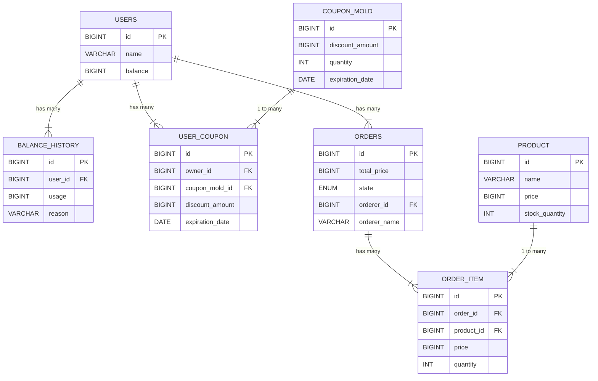

```mermaid
erDiagram
    USERS {
        BIGINT id PK
        VARCHAR name
        BIGINT balance
    }

    BALANCE_HISTORY {
        BIGINT id PK
        BIGINT user_id FK
        BIGINT usage
        VARCHAR reason
    }

    COUPON_MOLD {
        BIGINT id PK
        BIGINT discount_amount
        INT quantity
        DATE expiration_date
    }

    USER_COUPON {
        BIGINT id PK
        BIGINT owner_id FK
        BIGINT coupon_mold_id FK
        BIGINT discount_amount
        DATE expiration_date
    }

    PRODUCT {
        BIGINT id PK
        VARCHAR name
        BIGINT price
        INT stock_quantity
    }

    ORDERS {
        BIGINT id PK
        BIGINT total_price
        ENUM state
        BIGINT orderer_id FK
        VARCHAR orderer_name
    }

    ORDER_ITEM {
        BIGINT id PK
        BIGINT order_id FK
        BIGINT product_id FK
        BIGINT price
        INT quantity
    }

    %% RELATIONSHIPS
    
    USERS ||--|{ BALANCE_HISTORY : "has many"
    USERS ||--|{ USER_COUPON     : "has many"
    COUPON_MOLD ||--|{ USER_COUPON : "1 to many"
    ORDERS ||--|{ ORDER_ITEM     : "has many"
    PRODUCT ||--|{ ORDER_ITEM    : "1 to many"
    USERS ||--|{ ORDERS          : "has many"
```
