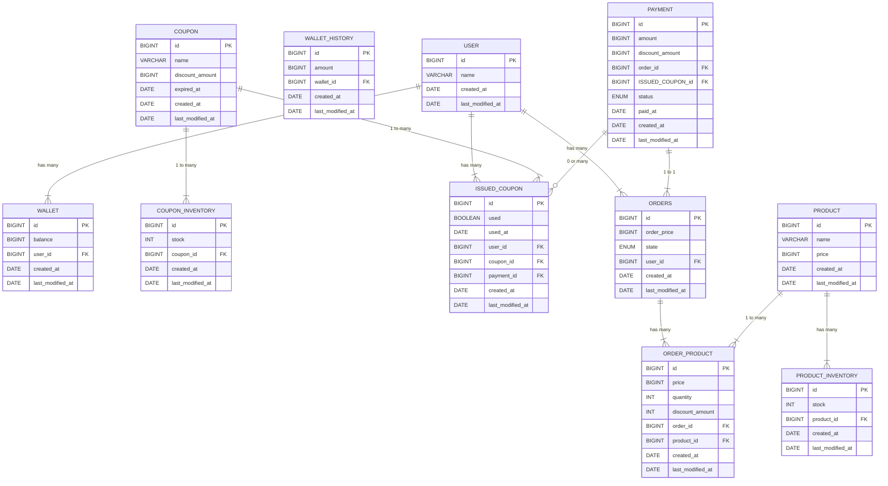

# E-Commerce APP ERD

# 목차

- [설명](#설명)
- [ERD](#erd)
- [USER (사용자)](#user-사용자)
- [WALLET (지갑)](#wallet-지갑)
- [WALLET_HISTORY (지갑 내역)](#wallet_history-지갑-내역)
- [COUPON_MOLD (쿠폰 모형)](#coupon_mold-쿠폰-모형)
- [COUPON_MOLD_INVENTORY (쿠폰 모형 재고)](#coupon_mold_inventory-쿠폰-모형-재고)
- [ORDERS (주문)](#orders-주문)
- [PAYMENT (결제)](#payment-결제)
- [ISSUED_COUPON (사용자 쿠폰)](#ISSUED_COUPON-사용자-쿠폰)
- [PRODUCT (상품)](#product-상품)
- [PRODUCT_INVENTORY (상품 재고)](#product_inventory-상품-재고)
- [ORDER_PRODUCT (주문 상품)](#order_product-주문-상품)

# 설명

이 문서는 E-Commerce APP의 ERD를 정의하고 설계 이유를 설명하는 문서입니다.

# ERD

# USER (사용자)

| 필드명              | 타입      | 설명      |
|------------------|---------|---------|
| id               | BIGINT  | PK      |
| name             | VARCHAR | 사용자 이름  |
| created_at       | DATE    | 생성일     |
| last_modified_at | DATE    | 마지막 수정일 |

- 사용자 정보를 저장하는 테이블

# WALLET (지갑)

| 필드명              | 타입      | 설명      |
|------------------|---------|---------|
| id               | BIGINT  | PK      |
| balance          | BIGINT  | 잔액      |
| user_id          | BIGINT  | FK      |
| created_at       | DATE    | 생성일     |
| last_modified_at | DATE    | 마지막 수정일 |

- 유저의 포인트를 저장하는 테이블
- 유저 포인트는 수정이 빈번하기 때문에, 별도의 테이블로 분리하여 관리

# WALLET_HISTORY (지갑 내역)

| 필드명              | 타입      | 설명      |
|------------------|---------|---------|
| id               | BIGINT  | PK      |
| amount           | BIGINT  | 금액      |
| wallet_id        | BIGINT  | FK      |
| created_at       | DATE    | 생성일     |
| last_modified_at | DATE    | 마지막 수정일 |

- 유저의 포인트 변동 내역을 저장하는 테이블

# COUPON (쿠폰)

| 필드명              | 타입      | 설명      |
|------------------|---------|---------|
| id               | BIGINT  | PK      |
| discount_amount  | BIGINT  | 할인 금액   |
| expiration_date  | DATE    | 만료일     |
| created_at       | DATE    | 생성일     |
| last_modified_at | DATE    | 마지막 수정일 |

- 쿠폰 정보를 저장하는 테이블

# COUPON_INVENTORY (쿠폰 재고)

| 필드명              | 타입      | 설명      |
|------------------|---------|---------|
| id               | BIGINT  | PK      |
| stock            | INT     | 재고      |
| coupon_id        | BIGINT  | FK      |
| created_at       | DATE    | 생성일     |
| last_modified_at | DATE    | 마지막 수정일 |

- 쿠폰 재고 정보를 저장하는 테이블
- 쿠폰 재고는 수정이 빈번하기 때문에, 별도의 테이블로 분리하여 관리

# ORDERS (주문)

| 필드명              | 타입      | 설명      |
|------------------|---------|---------|
| id               | BIGINT  | PK      |
| order_price      | BIGINT  | 총 가격    |
| state            | ENUM    | 주문 상태   |
| user_id          | BIGINT  | FK      |
| created_at       | DATE    | 생성일     |
| last_modified_at | DATE    | 마지막 수정일 |

- 주문 정보를 저장하는 테이블
- MySQL의 예약어인 `order`를 피하기 위해 복수명인 `orders`로 테이블 이름을 정의
- `state` 필드는 (주문, 결제, 배송, 완료) 등의 상태를 나타냄
- `user_id` 필드는 주문한 유저의 ID

# PAYMENT (결제)

| 필드명              | 타입      | 설명      |
|------------------|---------|---------|
| id               | BIGINT  | PK      |
| amount           | BIGINT  | 결제 금액   |
| discount_amount  | BIGINT  | 할인 금액   |
| order_id         | BIGINT  | FK      |
| ISSUED_COUPON_id   | BIGINT  | FK      |
| status           | ENUM    | 결제 상태   |
| paid_at          | DATE    | 결제 일시   |
| created_at       | DATE    | 생성일     |
| last_modified_at | DATE    | 마지막 수정일 |

- 결제 정보를 저장하는 테이블
- `status` 필드는 (결제 대기, 결제 완료, 결제 실패) 등의 상태를 나타냄
- `order_id` 필드는 결제한 주문의 ID
- `ISSUED_COUPON_id` 필드는 주문 결제 시 사용된 쿠폰의 ID

# ISSUED_COUPON (사용자 쿠폰)

| 필드명              | 타입      | 설명      |
|------------------|---------|---------|
| id               | BIGINT  | PK      |
| used             | BOOLEAN | 사용 여부   |
| used_at          | DATE    | 사용 일시   |
| user_id          | BIGINT  | FK      |
| coupon_id        | BIGINT  | FK      |
| payment_id       | BIGINT  | FK      |
| created_at       | DATE    | 생성일     |
| last_modified_at | DATE    | 마지막 수정일 |

- 사용자가 소유하고 있는 쿠폰 정보를 저장하는 테이블
- `used` 필드로 사용 여부를 확인할 수 있음

# PRODUCT (상품)

| 필드명              | 타입      | 설명      |
|------------------|---------|---------|
| id               | BIGINT  | PK      |
| name             | VARCHAR | 상품 이름   |
| price            | BIGINT  | 가격      |
| created_at       | DATE    | 생성일     |
| last_modified_at | DATE    | 마지막 수정일 |

- 상품 정보를 저장하는 테이블

# PRODUCT_INVENTORY (상품 재고)

| 필드명              | 타입      | 설명      |
|------------------|---------|---------|
| id               | BIGINT  | PK      |
| stock            | INT     | 재고      |
| product_id       | BIGINT  | FK      |
| created_at       | DATE    | 생성일     |
| last_modified_at | DATE    | 마지막 수정일 |

- 상품의 재고 정보를 저장하는 테이블
- 상품의 재고는 수정이 빈번하기 때문에, 별도의 테이블로 분리하여 관리

# ORDER_PRODUCT (주문 상품)

| 필드명              | 타입      | 설명      |
|------------------|---------|---------|
| id               | BIGINT  | PK      |
| price            | BIGINT  | 가격      |
| quantity         | INT     | 수량      |
| order_id         | BIGINT  | FK      |
| product_id       | BIGINT  | FK      |
| created_at       | DATE    | 생성일     |
| last_modified_at | DATE    | 마지막 수정일 |

- 주문한 상품 정보를 저장하는 테이블
- 상품 주문 시점에 가격 정보를 저장하는 스냅샷
