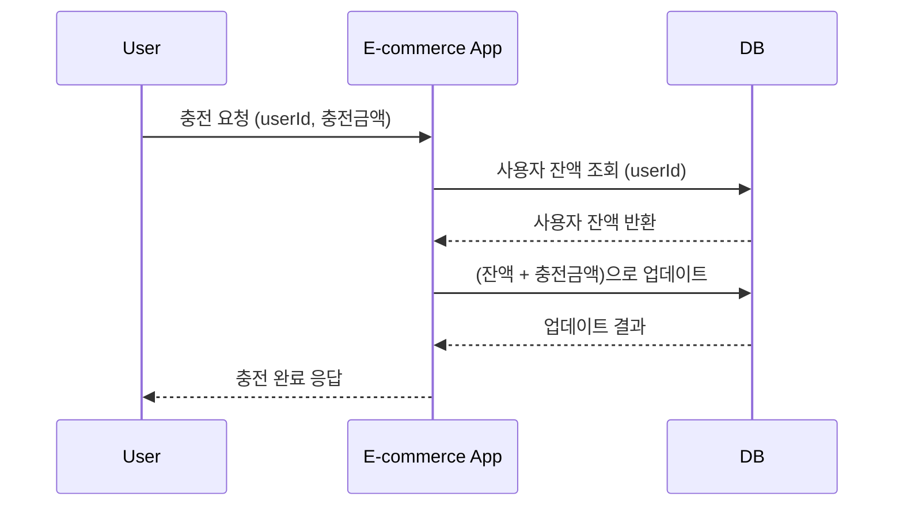
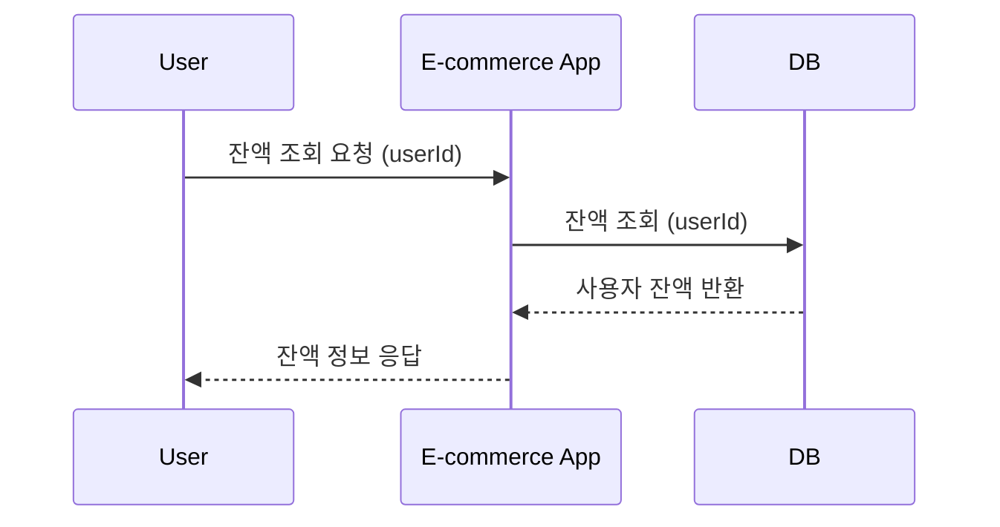
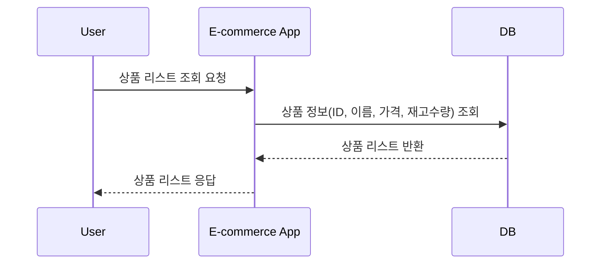
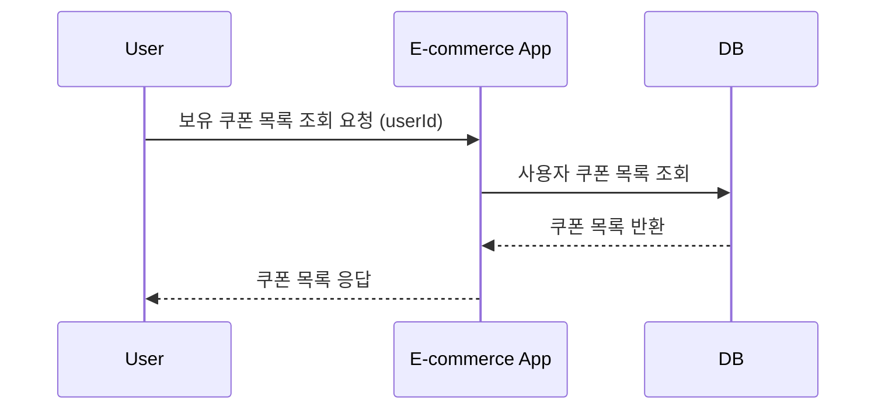
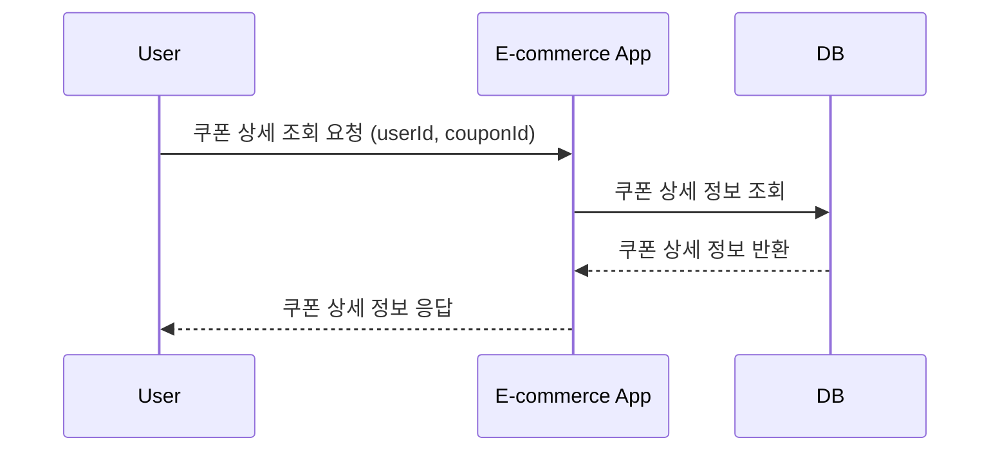
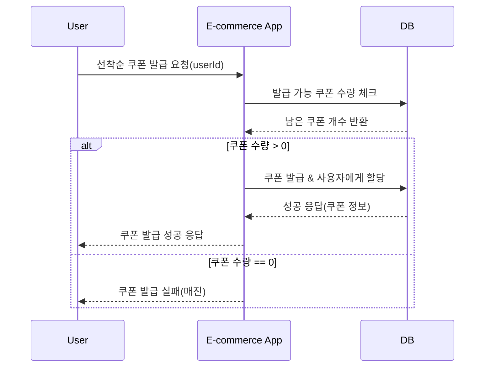
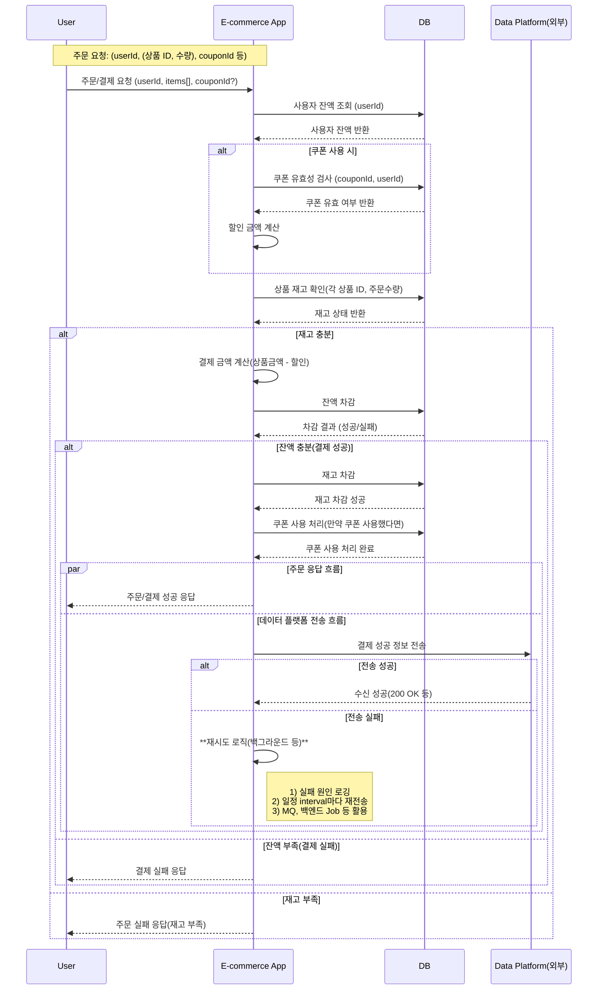
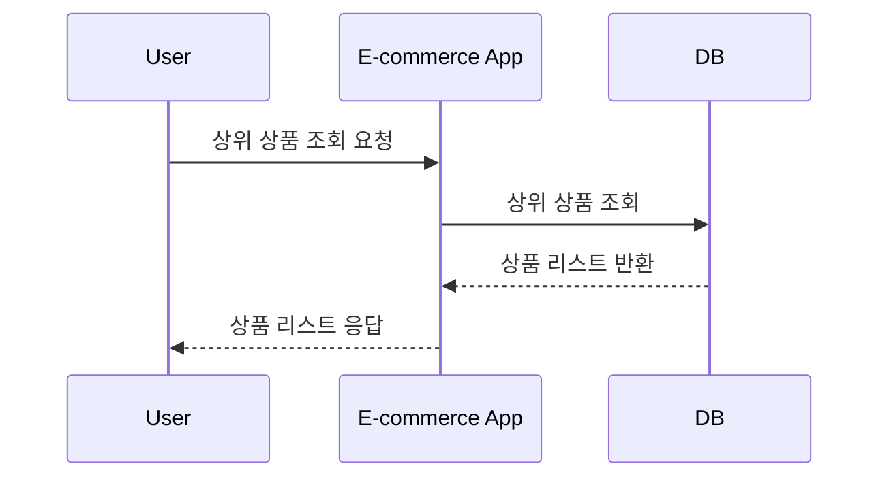

# E-commerce 서비스

# 목차

- [잔액 충전](#잔액-충전)
  - [요구사항 분석](#요구사항-분석)
  - [시퀀스 다이어그램](#시퀀스-다이어그램)
  - [API](#api)
- [잔액 조회](#잔액-조회)
  - [요구사항 분석](#요구사항-분석-1)
  - [시퀀스 다이어그램](#시퀀스-다이어그램-2)
  - [API](#api-3)
- [상품 조회](#상품-조회)
  - [요구사항 분석](#요구사항-분석-2)
  - [시퀀스 다이어그램](#시퀀스-다이어그램-2)
  - [API](#api-2)
- [유저가 보유한 쿠폰 목록 조회](#유저가-보유한-쿠폰-목록-조회)
  - [요구사항 분석](#요구사항-분석-3)
  - [시퀀스 다이어그램](#시퀀스-다이어그램-3)
  - [API](#api-3)
- [유저가 보유한 쿠폰 단건 조회](#유저가-보유한-쿠폰-단건-조회)
  - [요구사항 분석](#요구사항-분석-4)
  - [시퀀스 다이어그램](#시퀀스-다이어그램-4)
  - [API](#api-4)
- [선착순 할인 쿠폰 발급](#선착순-할인-쿠폰-발급)
  - [요구사항 분석](#요구사항-분석-5)
  - [시퀀스 다이어그램](#시퀀스-다이어그램-5)
  - [API](#api-5)
- [상품 주문/결제](#상품-주문결제)
  - [요구사항 분석](#요구사항-분석-6)
  - [시퀀스 다이어그램](#시퀀스-다이어그램-6)
  - [API](#api-6)
- [상위 상품 조회](#상위-상품-조회)
  - [요구사항 분석](#요구사항-분석-7)
  - [시퀀스 다이어그램](#시퀀스-다이어그램-7)
  - [API](#api-7)

# 설명

이 문서는 E-Commerce APP 프로젝트의 요구사항을 분석하고, 이에 대한 시퀀스 다이어그램, API 명세를 정의합니다.

# 잔액 충전

## 요구사항 분석

- 사용자는 충전 요청을 통해 잔액을 충전할 수 있어야 한다.
- 충전 요청은 사용자 ID와 충전 금액을 전달해야 한다.

## 시퀀스 다이어그램



## API

### Request

```http request
POST /api/v1/users/{userId}/balances
Content-Type: application/json

{
    "amount": 10000
}
```

| 요청 필드명   | 타입  | 설명        | 필수 여부 | 기본값 | 제약 조건                         |
|----------|-----|-----------|-------|-----|-------------------------------|
| `amount` | int | 충전 요청할 금액 | Y     |     | 0보다 크고, 21,000,000,00 보다 작은 값 |

### Response

#### 성공

```http request
204 No Content
Content-Type: application/json
Location: /api/v1/users/{userId}/balances
```

#### 잘못된 요청

```http request
400 Bad Request
Content-Type: application/json

{
    "errorCode": "INVALID_AMOUNT_REQUEST",
    "message": "충전 요청 금액이 올바르지 않습니다."
}
```

# 잔액 조회

## 요구사항 분석

- 사용자는 잔액 조회 요청을 통해 현재 잔액을 확인할 수 있어야 한다.
- 잔액 조회 요청은 사용자 ID를 전달해야 한다.

## 시퀀스 다이어그램



## API

### Request

```http request
GET /api/v1/users/{userId}/balances
```

### Response

#### 성공

```http request
200 OK
Content-Type: application/json

{
    "userId": "user1",
    "balance": 10000
}
```

| 응답 필드명    | 타입     | 설명     |
|-----------|--------|--------|
| `userId`  | string | 사용자 ID |
| `balance` | int    | 잔액     |


# 상품 조회

## 요구사항 분석

- 사용자는 상품 리스트를 조회할 수 있어야 한다.
- 상품 리스트 조회 요청은 페이지 번호, 페이지 크기, 정렬 기준을 전달할 수 있어야 한다.
- 상품 리스트는 상품 ID, 상품 이름, 가격, 재고 수량, 등록일시를 포함해야 한다.
- 상품 리스트는 정렬 기준에 따라 정렬되어야 하며 기본 정렬 기준은 등록일시 내림차순이다.

## 시퀀스 다이어그램



## API

### Request

```http request
GET /api/v1/products?page=1&size=10&sort=price,asc
```

| 파라미터명  | 타입     | 설명              | 필수 여부 | 기본값            | 제약 조건                       |
|--------|--------|-----------------|-------|----------------|-----------------------------|
| `page` | int    | 페이지 번호          | N     | 0              | 음수가 아닌 값                    |
| `size` | int    | 페이지 크기          | N     | 10             | 0 보다 크고 500 이하인 값           |
| `sort` | string | 정렬 기준 (필드명, 방향) | N     | createdAt,desc | `price,asc` 또는 `price,desc` |

### Response

#### 성공

```http request
200 OK
Content-Type: application/json

{
    "content": [
        {
            "productId": "product1",
            "productName": "상품1",
            "price": 10000,
            "stockQuantity": 100,
            "createdAt": "2021-08-01T00:00:00",
        },
        {
            "productId": "product2",
            "productName": "상품2",
            "price": 20000,
            "stockQuantity": 50,
            "createdAt": "2021-08-02T00:00:00",
        }
    ],
    "page": 1,
    "size": 10,
    "totalElements": 57,
    "totalPages": 6,
    "sort": "price,desc",
}
```

| 응답 필드명          | 타입     | 설명                  |
|-----------------|--------|---------------------|
| `content`       | array  | 상품 리스트              |
| `page`          | int    | 요청한 페이지 번호          |
| `size`          | int    | 페이지 크기              |
| `totalElements` | int    | 전체 요소 수             |
| `totalPages`    | int    | 전체 페이지 수            |
| `sort`          | string | 적용된 정렬 기준 (필드명, 방향) |

# 유저가 보유한 쿠폰 목록 조회

## 요구사항 분석

- 사용자는 보유한 쿠폰 목록을 조회할 수 있어야 한다.
- 쿠폰 목록 조회 요청은 사용자 ID를 전달해야 한다.
- 쿠폰 목록은 쿠폰 ID, 쿠폰 이름, 쿠폰 발급 일시를 포함해야 한다.
- 쿠폰 목록은 발급 일시 내림차순으로 정렬되어야 한다.
- 쿠폰 목록이 없는 경우 빈 배열을 반환해야 한다.
- 유저는 최대 100개의 쿠폰을 보유할 수 있다.

## 시퀀스 다이어그램



## API

### Request

```http request
GET /api/v1/users/{userId}/coupons
```

### Response

#### 성공

```http request
200 OK
Content-Type: application/json

[
    {
        "couponId": "C001",
        "couponName": "10% 할인 쿠폰",
        "receivedAt": "2021-08-01T00:00:00"
    },
    {
        "couponId": "C002",
        "couponName": "20% 할인 쿠폰",
        "receivedAt": "2021-08-02T00:00:00"
    },
    ...
]
```

# 유저가 보유한 쿠폰 단건 조회

## 요구사항 분석

- 사용자는 보유한 쿠폰 중 특정 쿠폰의 단건 정보를 조회할 수 있어야 한다.
- 쿠폰 단건 조회 요청은 사용자 ID와 쿠폰 ID를 전달해야 한다.
- 쿠폰 정보는 쿠폰 ID, 쿠폰 이름, 쿠폰 발급 일시, 쿠폰 만료 일시를 포함해야 한다.

## 시퀀스 다이어그램



## API

### Request

```http request
GET /api/v1/users/{userId}/coupons/{couponId}
```

### Response

#### 성공

```http request
200 OK
Content-Type: application/json

{
    "couponId": "C001",
    "couponName": "10% 할인 쿠폰",
    "receivedAt": "2021-08-01T00:00:00",
    "expiredAt": "2021-08-31T23:59:59"
}
```

# 선착순 할인 쿠폰 발급

## 요구사항 분석

- 사용자는 선착순 할인 쿠폰을 발급받을 수 있어야 한다.
- 쿠폰 발급 요청은 사용자 ID를 전달해야 한다.
- 쿠폰은 발급 가능한 수량이 남아있을 때만 발급받을 수 있다.
- 할인 쿠폰은 주문 시 사용할 수 있으며, 전체 주문 금액에서 할인된 금액을 차감한다.

## 시퀀스 다이어그램



## API

### Request

```http request
POST /api/v1/users/{userId}/coupons/{couponId}
```

### Response

#### 성공

```http request
201 Created
Content-Type: application/json
Location: /api/v1/users/{userId}/coupons/{couponId}
```

| 응답 필드명       | 타입     | 설명       |
|--------------|--------|----------|
| `couponId`   | string | 쿠폰 ID    |
| `couponName` | string | 쿠폰 이름    |
| `receivedAt` | string | 쿠폰 발급 일시 |

#### 쿠폰이 모두 발행된 경우

```http request
409 Conflict
Content-Type: application/json

{
    "errorCode": "COUPON_SOLD_OUT",
    "message": "쿠폰이 모두 소진되었습니다."
}
```

# 상품 주문/결제

## 요구사항 분석

- 사용자는 상품을 주문하고 결제할 수 있어야 한다.
- 주문/결제 요청은 사용자 ID, 상품 ID, 수량, 쿠폰 ID를 전달해야 한다.
- 주문/결제 요청 시 사용자 잔액을 확인하고, 잔액이 부족한 경우 주문/결제를 실패해야 한다.
- 주문/결제 요청 시 상품 재고를 확인하고, 재고가 부족한 경우 주문/결제를 실패해야 한다.
- 주문/결제 요청 시 쿠폰을 사용하고, 쿠폰이 유효하지 않은 경우 주문/결제를 실패해야 한다.
- 주문/결제 요청 시 쿠폰을 사용하고, 쿠폰이 유효한 경우 할인 금액을 적용해야 한다.
- 주문/결제 요청 시 주문 금액을 계산하고, 사용자 잔액에서 차감해야 한다.
- 주문/결제 요청 시 주문 금액을 계산하고, 상품 재고에서 차감해야 한다.
- 주문/결제 요청 시 주문 금액을 계산하고, 쿠폰 사용 처리를 해야 한다.
- 동시에 여러 주문이 들어올 경우, 각 사용자의 잔고와 주문 제품의 재고가 정확히 일치해야 한다.
- 주문/결제 요청 새 외부 데이터 플랫폼에 결제 정보를 전송해야 한다.

## 시퀀스 다이어그램



## API

### Request

```http request
POST /api/v1/orders
Content-Type: application/json

{
    "userId": "user1",
    "products": [
        {
            "productId": "product1",
            "quantity": 2
        },
        {
            "productId": "product2",
            "quantity": 1
        }
    ],
    "couponId": "C001"
}
```

| 요청 필드명     | 타입     | 설명             | 필수 여부 | 기본값 | 제약 조건 |
|------------|--------|----------------|-------|-----|-------|
| `userId`   | string | 주문자 ID         | Y     |     |       |
| `products` | array  | 주문 상품 목록       | Y     |     |       |
| `couponId` | string | 사용할 쿠폰 ID      | N     |     |       |

### Response

#### 성공

```http request
201 Created
Content-Type: application/json
Location: /api/v1/orders/{orderId}
```

#### 잔액 부족

```http request
400 Bad Request
Content-Type: application/json

{
    "errorCode": "INSUFFICIENT_BALANCE",
    "message": "잔액이 부족합니다."
}
```

#### 재고 부족

```http request
400 Bad Request
Content-Type: application/json

{
    "errorCode": "INSUFFICIENT_STOCK",
    "message": "재고가 부족합니다."
}
```

#### 쿠폰 유효하지 않음

```http request
400 Bad Request
Content-Type: application/json

{
    "errorCode": "INVALID_COUPON",
    "message": "유효하지 않은 쿠폰입니다."
}
```

#  상위 상품 조회

## 요구사항 분석

- 사용자는 특정 기간 동안 가장 많이 판매된 상품을 조회할 수 있어야 한다.
- 상위 상품 조회 요청은 조회 시작일, 조회 종료일, 페이지 번호, 페이지 크기를 전달해야 한다.
- 상위 상품은 판매 수량이 많은 순으로 정렬되어야 한다.
- 상위 상품은 상품 ID, 상품 이름, 판매 수량을 포함해야 한다.

## 시퀀스 다이어그램



## API

### Request

```http request
GET /api/v1/products/top-solds?startDate=2021-08-01&endDate=2021-08-31&page=0&size=10
```

| 파라미터명       | 타입     | 설명       | 필수 여부 | 기본값 | 제약 조건          |
|-------------|--------|----------|-------|-----|----------------|
| `startDate` | string | 조회 시작 일자 | Y     |     | UTC 타임         |
| `endDate`   | string | 조회 종료 일자 | Y     |     | UTC 타임         |
| `page`      | int    | 페이지 번호   | N     | 0   | 음수가 아닌 값       |
| `size`      | int    | 페이지 크기   | N     | 10  | 1 이상 500 이하인 값 |

### Response

#### 성공

```http request
200 OK
Content-Type: application/json

{
    "content": [
        {
            "productId": "product1",
            "productName": "상품1",
            "soldCount": 100
        },
        {
            "productId": "product2",
            "productName": "상품2",
            "soldCount": 50
        }
    ],
    "page": 0,
    "size": 10,
    "totalElements": 57,
    "totalPages": 6,
}
```

| 응답 필드명                | 타입     | 설명         |
|-----------------------|--------|------------|
| `content`             | array  | 상품 리스트     |
| `content.productId`   | string | 상품 ID      |
| `content.productName` | string | 상품 이름      |
| `content.soldCount`   | int    | 판매 수량      |
| `page`                | int    | 요청한 페이지 번호 |
| `size`                | int    | 페이지 크기     |
| `totalElements`       | int    | 전체 요소 수    |
| `totalPages`          | int    | 전체 페이지 수   |
